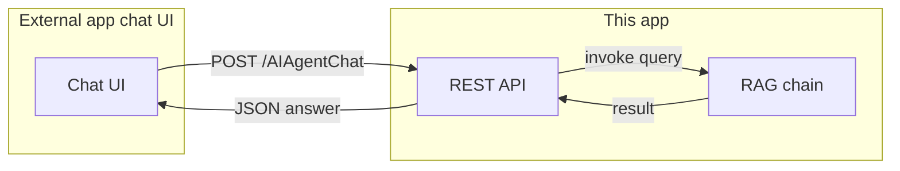

# Plan: REST API for agent conversation (API Style)

## Status

**Phase 1: Completed.** Implementation done; smoke test completed successfully. API runs on port **8193** (see [api.py](api.py), [README.md](README.md)).

## Goal

Expose the RAG chat as a REST API so an external app’s chat interface can send a user message and get an answer, without changing the existing RAG logic in [rag_chain.py](rag_chain.py).

## Architecture

- **New component:** A small API server (single process) that loads the RAG chain and exposes HTTP endpoints.
- **Reuse:** [rag_chain.py](rag_chain.py) unchanged; API calls `get_rag_chain()` and `chain.invoke({"query": message})["result"]` (same as [app.py](app.py) lines 50–51).
- **Streamlit:** Unchanged; remains a separate entrypoint for local use (`streamlit run app.py`). The external app will call the API, not Streamlit.

## API design

- **Framework:** FastAPI (async, automatic OpenAPI docs at `/docs`, type hints, minimal boilerplate).
- **Base URL:** e.g. `http://localhost:8193` (port 8193).

| Endpoint         | Method | Purpose                                                                        |
| ---------------- | ------ | ------------------------------------------------------------------------------ |
| `/AIAgentHealth` | GET    | Liveness/readiness; returns 200 when server and (optionally) RAG setup are OK. |
| `/AIAgentChat`   | POST   | Send one message, get one RAG answer.                                          |

**POST /AIAgentChat**

- **Request body:** `{ "message": "user question text" }` (required).
- **Success (200):** `{ "answer": "RAG response text" }`.
- **Errors:** 400 if `message` missing or empty; 503 if vector_db or GROQ not ready; 500 on unexpected failure. Use JSON error body e.g. `{ "detail": "..." }` (FastAPI default).

No auth in this phase (add in a later phase if needed).

## Implementation outline

1. **Add dependency**
  In [requirements.txt](requirements.txt): add `uvicorn[standard]>=0.24.0` and `fastapi>=0.104.0` (or current stable).
2. **New API module**
  Create a single file, e.g. [api.py](api.py) at project root, that:
  - Loads `.env` (e.g. `python-dotenv`), same as existing app.
  - Creates a FastAPI app.
  - Defines GET `/AIAgentHealth`: check `GROQ_API_KEY` and `vector_db/` existence (same checks as [app.py](app.py) `check_setup()`); return 200 if OK, 503 with detail if not.
  - Defines POST `/AIAgentChat`: parse body `{ "message": str }`, validate non-empty; call `get_rag_chain()` to obtain the chain (see note below), then `chain.invoke({"query": message})["result"]`; return `{ "answer": result }`; handle exceptions and return appropriate status (e.g. 503 for missing setup, 500 for Groq/other errors).
  - **Chain lifecycle:** Call `get_rag_chain()` once at startup (e.g. in a lifespan or startup event) and hold the chain in a module-level or app-state variable so each request reuses it. This avoids loading FAISS on every request. Reloading the chain (e.g. after on-demand ingest) can be a later step; for this phase, load once at startup.
3. **Run instructions**
  - Document in [README.md](README.md): install deps, ensure `.env` and `vector_db/` (run `python ingest.py` if needed), then start API with `uvicorn api:app --reload --host 0.0.0.0 --port 8193` (or `python -m uvicorn api:app ...`). OpenAPI docs at `http://localhost:8193/docs`.
4. **Optional: streamed response**
  Defer to a follow-up: add a second endpoint (e.g. POST `/AIAgentChat/stream`) that returns Server-Sent Events or a streaming response if the external UI needs word-by-word output.

## Files to add/change

| Action | File                                                                                              |
| ------ | ------------------------------------------------------------------------------------------------- |
| Add    | [api.py](api.py) — FastAPI app, `/AIAgentHealth`, `/AIAgentChat`, startup chain load.             |
| Edit   | [requirements.txt](requirements.txt) — add `fastapi`, `uvicorn[standard]`.                        |
| Edit   | [README.md](README.md) — short “REST API” section: how to run, example `curl` or link to `/docs`. |

## Out of scope for this plan

- Authentication/authorization.
- On-demand ingestion (separate plan).
- Streaming response (can add later).
- Conversation/session state (single-turn only; client sends one message, gets one answer).

