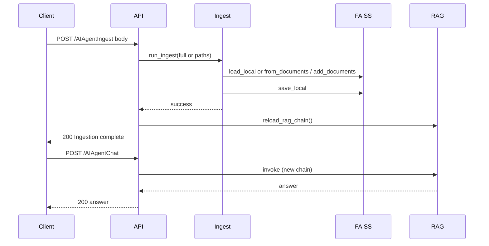

# Phase 2: On-Demand Ingestion

## Status

**Completed.** Phase 2 implemented and verified. POST /AIAgentIngest (full re-ingest and incremental add), `reload_rag_chain()`, Streamlit "Reload index" button, and ingest module changes ([ingest.py](ingest.py), [api.py](api.py), [app.py](app.py)) are in place. See [running_notes/phase2_activities.md](running_notes/phase2_activities.md).

## Goal

Remove the limitation that ingestion requires running `python ingest.py` and restarting the server. After Phase 2:

- Ingestion can be triggered via an API endpoint (full re-ingest or add specific files).
- The running API server reloads the RAG chain after ingest so new/updated docs are used immediately.
- The Streamlit app can refresh the index on demand (e.g. a "Reload index" control) so it uses the updated index without restarting.

## Current State

- **[ingest.py](ingest.py)**: Batch-only. `load_documents()` reads all `.html`/`.pdf`/`.json` from `data/`; `ingest()` builds a new FAISS index from scratch and saves to `vector_db/`. No way to add a single file or trigger from the API.
- **[api.py](api.py)**: Loads the RAG chain once at startup (`lifespan`). No endpoint to trigger ingest or reload the chain.
- **[rag_chain.py](rag_chain.py)**: `get_rag_chain()` loads FAISS from disk each time it is called; no in-memory state, so reload = call again.
- **[app.py](app.py)**: Uses `@st.cache_resource` for `load_chain()`; cache is never cleared, so new index on disk is not picked up until Streamlit is restarted.

## Design

### 1. Ingestion modes

| Mode            | When                                             | Behavior                                                                                                                                                                                         |
| --------------- | ------------------------------------------------ | ------------------------------------------------------------------------------------------------------------------------------------------------------------------------------------------------ |
| **Full**        | POST /ingest with no paths (or empty body)       | Same as current `ingest()`: load all from `data/`, split, embed, build new FAISS, save. Replaces index.                                                                                          |
| **Incremental** | POST /ingest with `paths: ["data/new.pdf", ...]` | Load existing FAISS from `vector_db/`; load only the given files; split and embed; `vectorstore.add_documents(chunks)`; save. If `vector_db/` does not exist, create index from these docs only. |

Incremental uses LangChain FAISS `add_documents()` (and existing `load_local` / `save_local`). Same chunking and embedding model as full ingest so retrieval stays consistent.

### 2. API changes ([api.py](api.py))

- **POST /AIAgentIngest** (or POST /ingest):  
  - Optional body: `{ "paths": ["data/file.pdf"] }`. Omit or empty `paths` = full re-ingest; provide paths = incremental add (paths relative to project root or under `data/`).
  - Run ingestion (full or incremental) in process. For long-running ingest, run the CPU-bound work in a thread (e.g. `asyncio.to_thread`) so the event loop is not blocked.
  - On success: **reload RAG chain** (call `get_rag_chain()` and replace the held reference so `_chain` or `app.state.chain` points to the new chain), then return 200 with a short message (e.g. "Ingestion complete; RAG chain reloaded").
  - On failure: return 4xx/5xx with detail (e.g. no files found, invalid path, embedding error).
  - Consider 409 or 423 if you want to block chat during ingest; otherwise allow concurrent chat with previous index until reload completes.
- **Chain reload**: Introduce a small helper (e.g. `reload_rag_chain()`) that calls `get_rag_chain()` and updates the global or `app.state` reference used by `/AIAgentChat` and `/AIAgentHealth`. Call this after successful ingest.

### 3. Ingestion module changes ([ingest.py](ingest.py))

- **Keep** `load_documents()` and `ingest()` for full batch and CLI `python ingest.py` behavior unchanged.
- **Add** a function that loads documents from a **list of file paths** only, e.g. `load_documents_from_paths(paths: list[str])` (reuse existing loader logic by file extension; validate paths under `data/` or allow project-relative paths for safety).
- **Add** `ingest_incremental(paths: list[str])`:  
  - If `vector_db/` exists: `FAISS.load_local(...)`, then load docs from `paths`, split, `vectorstore.add_documents(chunks)`, `vectorstore.save_local(...)`.  
  - If not: create index from those docs only (`FAISS.from_documents(...)`, then save), so first "incremental" run is valid.
- **Expose** a single callable for the API, e.g. `run_ingest(full: bool = True, paths: list[str] | None = None)`: if `full` or `paths` is None/empty, call `ingest()`; else call `ingest_incremental(paths)`. Return a simple result (success + message or raise on error).

### 4. Streamlit refresh ([app.py](app.py))

- Add a way to reload the index after it has been updated (e.g. by the API or by running `python ingest.py` elsewhere):
  - **Option A (recommended):** Sidebar or small control "Reload index" that clears the `load_chain` cache (`load_chain.clear()`) and triggers a rerun so the next request uses the updated index.
  - **Option B:** Document that users should refresh the browser or restart Streamlit after external ingest.

No change to RAG logic in [rag_chain.py](rag_chain.py); it already loads from disk on each `get_rag_chain()` call.

### 5. Safety and validation

- **Paths:** For incremental, restrict paths to project directory (or under `data/`) to avoid reading arbitrary files. Reject paths that don’t exist or aren’t supported (e.g. only `.pdf`, `.html`, `.json`).
- **Concurrency:** If ingest is long, either run it in a background thread and return 202 Accepted with "Ingestion started" and a separate way to know when done, or run it in-thread with a long timeout and return 200 when done. Plan assumes in-thread with long timeout for simplicity; optional later: background job + status endpoint.

## Architecture (high level)

## Files to add/change

| Action   | File                                                                                       | Change                                                                                                                                    |
| -------- | ------------------------------------------------------------------------------------------ | ----------------------------------------------------------------------------------------------------------------------------------------- |
| Edit     | [ingest.py](ingest.py)                                                                     | Add `load_documents_from_paths(paths)`, `ingest_incremental(paths)`, and `run_ingest(full, paths)` for API use.                           |
| Edit     | [api.py](api.py)                                                                           | Add POST `/AIAgentIngest` (optional body `paths`), run ingest (full or incremental), then `reload_rag_chain()`; add `reload_rag_chain()`. |
| Edit     | [app.py](app.py)                                                                           | Add "Reload index" control that clears `load_chain` cache and reruns.                                                                     |
| Edit     | [README.md](README.md)                                                                     | Document on-demand ingestion: POST /AIAgentIngest, full vs incremental, and Streamlit "Reload index".                                     |
| Optional | [running_notes/phase1_activities.md](running_notes/phase1_activities.md) or new phase2 doc | Note Phase 2 scope and link to README/API docs.                                                                                           |

## Out of scope for this plan

- File upload (multipart) in the API; only trigger ingest of files already under `data/` (or allowed paths).
- Authentication on `/AIAgentIngest` (add in a later phase if needed).
- Background job queue or webhook for "ingest complete".
- Deleting or updating specific documents in the index (only add/full replace).

